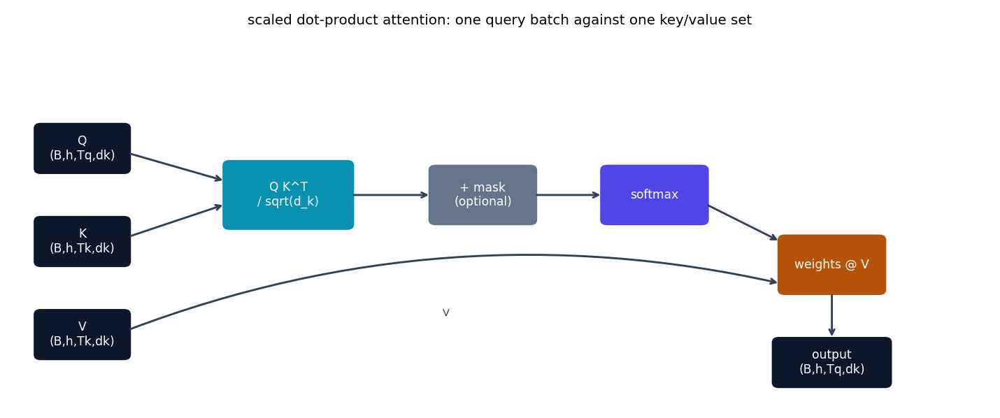

# Attention, from scratch

Every model in this repo reuses one core operation: **attention**, the
mechanism {cite:t}`vaswani2017transformer` built the Transformer around.
This page is the one place that operation is explained on its own terms --
what it computes, why the formula looks the way it does, and exactly how
it's coded -- separately from any one model's architecture. See
{doc}`encoder_decoder` for how attention gets *arranged* into encoder-only,
decoder-only, and encoder-decoder models.

## What attention actually computes

Forget transformers for a second. Attention is a **differentiable lookup
table**: you have a query $q$, a set of keys $k_1, \dots, k_n$ (one per
"item" in the table), and a matching set of values $v_1, \dots, v_n$. You
want to retrieve *some blend* of the values, weighted by how well the query
matches each key -- not a hard lookup (pick exactly one item), a *soft* one
(a weighted average, so the whole thing stays differentiable and trainable
end to end).

"How well the query matches each key" is a similarity score. The
Transformer's specific choice of similarity is a scaled dot product:

$$
\text{score}(q, k_i) = \frac{q \cdot k_i}{\sqrt{d_k}}
$$

$d_k$ is the dimensionality of $q$ and $k_i$. The dot product's *typical
magnitude* grows with $d_k$ (summing more terms), which pushes softmax
into a regime where it saturates -- nearly all its output mass concentrates
on the single largest score, gradients through the rest vanish, and
training stalls. Dividing by $\sqrt{d_k}$ keeps the scores' variance
roughly constant regardless of dimensionality, so softmax stays in a
well-behaved range no matter how wide the model is.

Turning those scores into weights, and the weights into a blended output,
is one softmax and one weighted sum:

$$
\text{Attention}(Q, K, V) = \text{softmax}\!\left(\frac{QK^\top}{\sqrt{d_k}}\right)V
$$

Written for a whole *sequence* of queries at once (not just one $q$), $Q$,
$K$, $V$ are matrices -- one row per position -- and $QK^\top$ computes
every query's score against every key in a single matrix multiply: an
$(T_q \times T_k)$ matrix of scores, one row per query position.

## In code, literally

This is the entire operation, taken verbatim from
[`models/transformer/model.py`](https://github.com/agpoks/transformer-playground/blob/main/models/transformer/model.py)
(every other model's attention function is the same handful of lines,
copied and adapted, never imported from a shared file -- see
{doc}`adding_a_model` for why this repo duplicates rather than shares):

```python
def scaled_dot_product_attention(q, k, v, mask=None):
    """q, k, v: (B, h, T, d_k). mask: True = masked OUT (blocked)."""
    d_k = q.shape[-1]
    scores = q @ k.transpose(-2, -1) / d_k ** 0.5
    if mask is not None:
        scores = scores.masked_fill(mask, float("-inf"))
    weights = torch.softmax(scores, dim=-1)
    return weights @ v
```

Six lines. Everything else in every model here -- multi-head projection,
positional encoding, the whole encoder/decoder scaffolding -- is built on
top of exactly this.



```{eval-rst}
.. plot::

    from transformer_playground.utils.diagrams import new_ax, box, arrow, INPUT, LINEAR, NONLIN, ATTN, OTHER

    fig, ax = new_ax(figsize=(11.0, 4.6), xlim=(0, 17), ylim=(0, 8))

    box(ax, 1.2, 5.5, 1.6, 1.0, "Q\n(B,h,Tq,dk)", INPUT)
    box(ax, 1.2, 3.5, 1.6, 1.0, "K\n(B,h,Tk,dk)", INPUT)
    box(ax, 1.2, 1.5, 1.6, 1.0, "V\n(B,h,Tk,dk)", INPUT)

    box(ax, 4.8, 4.5, 2.2, 1.4, "Q K^T\n/ sqrt(d_k)", LINEAR)
    box(ax, 8.2, 4.5, 1.8, 1.2, "+ mask\n(optional)", OTHER)
    box(ax, 11.2, 4.5, 1.8, 1.2, "softmax", NONLIN)
    box(ax, 14.3, 3.0, 1.8, 1.2, "weights @ V", ATTN)
    box(ax, 14.3, 0.9, 2.0, 1.0, "output\n(B,h,Tq,dk)", INPUT)

    arrow(ax, (2.0, 5.4), (3.7, 4.8))
    arrow(ax, (2.0, 3.6), (3.7, 4.3))
    arrow(ax, (5.9, 4.5), (7.3, 4.5))
    arrow(ax, (9.1, 4.5), (10.3, 4.5))
    arrow(ax, (12.1, 4.3), (13.4, 3.5))
    arrow(ax, (2.0, 1.6), (13.4, 2.6), curve=-0.15)
    ax.text(7.5, 1.9, "V", fontsize=8, color="#334155")
    arrow(ax, (14.3, 2.4), (14.3, 1.4))

    ax.set_title("scaled dot-product attention: one query batch against one key/value set", fontsize=11)
```

## Multi-head attention

One attention operation computes one *kind* of relationship between
positions. Multi-head attention runs $h$ of them in parallel, each on its
own learned linear projection of $Q$, $K$, $V$, so different heads are
free to specialize -- one might learn to track adjacent-token relationships,
another long-range ones, another something no simple name applies to:

$$
\text{MultiHead}(Q,K,V) = \text{Concat}(\text{head}_1, \dots, \text{head}_h)\,W^O,
\qquad \text{head}_i = \text{Attention}(QW_i^Q,\ KW_i^K,\ VW_i^V)
$$

In code, this is `nn.Linear` projections splitting the model dimension
`d_model` into `h` heads of size `d_k = d_model / h`, running the function
above on each head in parallel (as one batched tensor op, not a Python
loop), then concatenating and projecting back down:

```python
class MultiHeadAttention(nn.Module):
    def __init__(self, d_model, n_heads):
        super().__init__()
        self.n_heads = n_heads
        self.d_k = d_model // n_heads
        self.w_q = nn.Linear(d_model, d_model)
        self.w_k = nn.Linear(d_model, d_model)
        self.w_v = nn.Linear(d_model, d_model)
        self.w_o = nn.Linear(d_model, d_model)

    def _split_heads(self, x):
        b, t, _ = x.shape
        return x.view(b, t, self.n_heads, self.d_k).transpose(1, 2)

    def forward(self, q_in, k_in, v_in, mask=None):
        b, t_q, d_model = q_in.shape
        q = self._split_heads(self.w_q(q_in))
        k = self._split_heads(self.w_k(k_in))
        v = self._split_heads(self.w_v(v_in))
        out = scaled_dot_product_attention(q, k, v, mask=mask)
        out = out.transpose(1, 2).contiguous().view(b, t_q, d_model)
        return self.w_o(out)
```

No `torch.nn.MultiheadAttention` anywhere -- this is the entire mechanism,
in about 20 lines, and every model in this repo either uses this exact
class or a close variant of it (RoPE rotates $Q$/$K$ before this function
runs; the linear-attention model in {doc}`models/linattn` replaces the
softmax kernel itself; everything else about the surrounding scaffolding
is unchanged).

## The mask is what makes attention become *different* models

Nothing above says anything about masking direction -- `mask` is just an
optional additive term. What that mask *contains* is the single choice
that turns the same six-line function into three structurally different
kinds of model, all built in this repo:

| Mask | Who can attend to whom | Used by |
|---|---|---|
| None (no mask) | every position sees every other position | {doc}`models/bert`, {doc}`models/patchtst`, {doc}`models/perceiver`'s self-attention, {doc}`models/tirewear` |
| Causal (upper-triangular) | position $i$ sees only positions $\le i$ | {doc}`models/gpt`, {doc}`models/linattn`, {doc}`models/decisiontransformer` |
| Cross (Q from one sequence, K/V from another) | every decoder position sees the *entire* encoder output | {doc}`models/transformer`'s decoder, {doc}`models/perceiver`'s latents reading the input array |

See {doc}`encoder_decoder` for exactly how these three masking choices
combine into full architectures.

## References

```{eval-rst}
.. bibliography::
   :filter: docname in docnames
```
