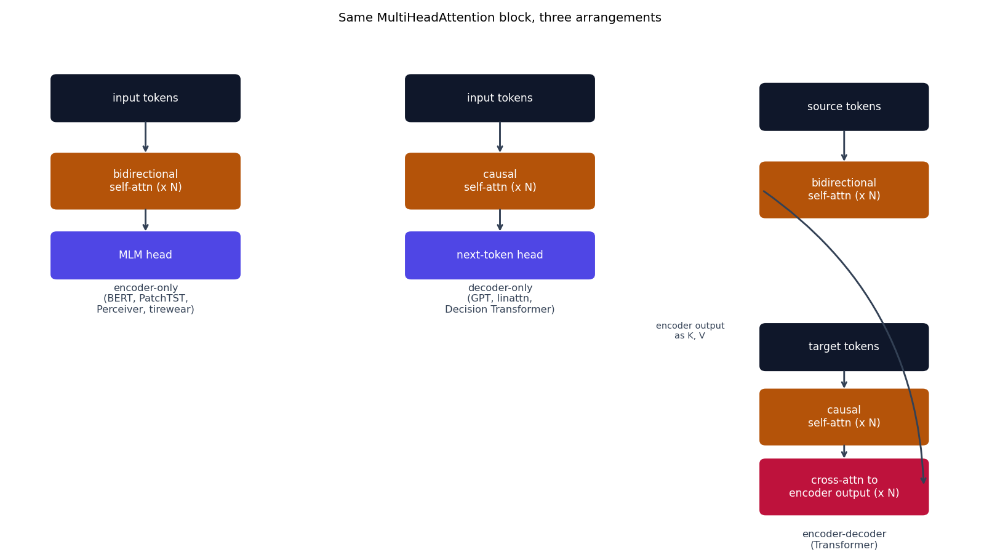

# Encoder vs. decoder, from scratch

{doc}`attention_explained` covers what attention computes and how it's
coded. This page covers the other half: how attention gets *arranged*
into a full model, and specifically what "encoder" and "decoder" mean in
this context -- not the autoencoder sense (compress, then reconstruct),
the {cite:t}`vaswani2017transformer` sense (one stack that reads the whole
input at once, one stack that generates output autoregressively).

## Three architectural patterns, one building block

Every model in this repo is built from the same
[`MultiHeadAttention`](attention_explained.md#multi-head-attention) block.
What differs between an encoder-only model, a decoder-only model, and a
full encoder-decoder model is *only* which of the three mask patterns from
{doc}`attention_explained` get used, and in what arrangement:



```{eval-rst}
.. plot::

    from transformer_playground.utils.diagrams import new_ax, box, arrow, INPUT, LINEAR, NONLIN, ATTN, STATE, OTHER

    fig, ax = new_ax(figsize=(12.5, 7.0), xlim=(0, 19), ylim=(0, 11.5))

    # Encoder-only (BERT)
    box(ax, 2.6, 9.9, 3.6, 1.0, "input tokens", INPUT)
    box(ax, 2.6, 8.0, 3.6, 1.2, "bidirectional\nself-attn (x N)", ATTN)
    box(ax, 2.6, 6.3, 3.6, 1.0, "MLM head", NONLIN)
    arrow(ax, (2.6, 9.4), (2.6, 8.6))
    arrow(ax, (2.6, 7.4), (2.6, 6.8))
    ax.text(2.6, 5.0, "encoder-only\n(BERT, PatchTST,\nPerceiver, tirewear)", ha="center", fontsize=9, color="#334155")

    # Decoder-only (GPT)
    box(ax, 9.5, 9.9, 3.6, 1.0, "input tokens", INPUT)
    box(ax, 9.5, 8.0, 3.6, 1.2, "causal\nself-attn (x N)", ATTN)
    box(ax, 9.5, 6.3, 3.6, 1.0, "next-token head", NONLIN)
    arrow(ax, (9.5, 9.4), (9.5, 8.6))
    arrow(ax, (9.5, 7.4), (9.5, 6.8))
    ax.text(9.5, 5.0, "decoder-only\n(GPT, linattn,\nDecision Transformer)", ha="center", fontsize=9, color="#334155")

    # Encoder-decoder (Transformer)
    box(ax, 16.2, 9.7, 3.2, 1.0, "source tokens", INPUT)
    box(ax, 16.2, 7.8, 3.2, 1.2, "bidirectional\nself-attn (x N)", ATTN)
    box(ax, 16.2, 4.2, 3.2, 1.0, "target tokens", INPUT)
    box(ax, 16.2, 2.6, 3.2, 1.2, "causal\nself-attn (x N)", ATTN)
    box(ax, 16.2, 1.0, 3.2, 1.2, "cross-attn to\nencoder output (x N)", STATE)
    arrow(ax, (16.2, 9.2), (16.2, 8.4))
    arrow(ax, (16.2, 3.7), (16.2, 3.2))
    arrow(ax, (16.2, 2.0), (16.2, 1.6))
    arrow(ax, (14.6, 7.8), (14.6, 1.0), curve=0.0)
    arrow(ax, (14.6, 1.0), (14.6, 1.0))
    ax.annotate("", xy=(17.75, 1.0), xytext=(14.6, 7.8),
                arrowprops=dict(arrowstyle="->", color="#334155", lw=1.6,
                                connectionstyle="arc3,rad=-0.25"))
    ax.text(13.2, 4.4, "encoder output\nas K, V", fontsize=8, color="#334155", ha="center")
    ax.text(16.2, -0.4, "encoder-decoder\n(Transformer)", ha="center", fontsize=9, color="#334155")

    ax.set_title("Same MultiHeadAttention block, three arrangements", fontsize=11)
```

| Pattern | Mask(s) used | What it's for | Models here |
|---|---|---|---|
| **Encoder-only** | none (bidirectional) | build a representation of a whole, already-complete input -- classification, regression, masked-token prediction | {doc}`models/bert`, {doc}`models/patchtst`, {doc}`models/conformer`, {doc}`models/tirewear` |
| **Decoder-only** | causal | generate output one step at a time, each step conditioned only on what came before | {doc}`models/gpt`, {doc}`models/linattn`, {doc}`models/decisiontransformer` |
| **Encoder-decoder** | encoder: none; decoder: causal + cross-attention | *transform* one whole sequence into a different one (translation) -- the decoder needs to both generate autoregressively **and** stay conditioned on the full source | {doc}`models/transformer` |
| **Latent cross-attention** (a fourth pattern, not in the classic three) | cross-attention only, from a small fixed latent array to a large input array | decouple compute from input size, no notion of masking direction needed at all | {doc}`models/perceiver` |

## Encoder, from scratch

An encoder layer is nothing more than: bidirectional self-attention, a
residual connection, a position-wise feed-forward network, another
residual connection. Verbatim from
[`models/transformer/model.py`](https://github.com/agpoks/transformer-playground/blob/main/models/transformer/model.py)
(post-norm, matching the original paper -- see {doc}`models/gpt` for the
pre-norm alternative most modern models use instead):

```python
class EncoderLayer(nn.Module):
    def __init__(self, d_model, n_heads, d_ff, dropout=0.1):
        super().__init__()
        self.self_attn = MultiHeadAttention(d_model, n_heads)
        self.ff = FeedForward(d_model, d_ff)
        self.norm1 = nn.LayerNorm(d_model)
        self.norm2 = nn.LayerNorm(d_model)
        self.drop = nn.Dropout(dropout)

    def forward(self, x, src_mask):
        x = self.norm1(x + self.drop(self.self_attn(x, x, x, src_mask)))  # post-norm
        x = self.norm2(x + self.drop(self.ff(x)))
        return x
```

`src_mask` is `None` for a purely bidirectional encoder (as in
{doc}`models/bert`) -- {doc}`models/transformer` also passes a *padding*
mask here (blocking attention to `<pad>` tokens), which is a different,
orthogonal use of the same `mask` argument from {doc}`attention_explained`,
not a causal mask.

## Decoder, from scratch

A decoder layer adds two things on top of an encoder layer: the
self-attention is **causal** (masked so position $i$ can't see position
$j > i$), and there's a second attention block, **cross-attention**, whose
queries come from the decoder but whose keys and values come from the
encoder's output -- this is the *only* place information from the source
sequence enters the decoder. Verbatim, same file:

```python
class DecoderLayer(nn.Module):
    def __init__(self, d_model, n_heads, d_ff, dropout=0.1):
        super().__init__()
        self.self_attn = MultiHeadAttention(d_model, n_heads)
        self.cross_attn = MultiHeadAttention(d_model, n_heads)
        self.ff = FeedForward(d_model, d_ff)
        self.norm1 = nn.LayerNorm(d_model)
        self.norm2 = nn.LayerNorm(d_model)
        self.norm3 = nn.LayerNorm(d_model)
        self.drop = nn.Dropout(dropout)

    def forward(self, x, enc_out, tgt_mask, src_mask):
        x = self.norm1(x + self.drop(self.self_attn(x, x, x, tgt_mask)))          # causal
        x = self.norm2(x + self.drop(self.cross_attn(x, enc_out, enc_out, src_mask)))  # cross
        x = self.norm3(x + self.drop(self.ff(x)))
        return x
```

Note exactly what changes between `self_attn(x, x, x, ...)` and
`cross_attn(x, enc_out, enc_out, ...)`: the query argument stays `x` (the
decoder's own sequence) in both calls -- only the key/value argument
changes, from the decoder's own sequence to the encoder's output. That one
substitution is the entire mechanical difference between self-attention
and cross-attention; nothing else about `MultiHeadAttention` changes.

A **decoder-only** model ({doc}`models/gpt`, {doc}`models/decisiontransformer`)
is simpler still -- it's just the causal half above, with the
`cross_attn` block and everything encoder-related deleted entirely:
there is no source sequence to cross-attend to, only the sequence being
generated, attending causally to itself.

## Try it

Compare the full encoder-decoder ({doc}`models/transformer`) directly
against the decoder-only causal model ({doc}`models/gpt`) and the
encoder-only bidirectional model ({doc}`models/bert`) -- all three are
runnable from the repo root:

```bash
python models/transformer/example.py --device auto
python models/gpt/example.py --device auto
python models/bert/example.py --device auto
```

## References

```{eval-rst}
.. bibliography::
   :filter: docname in docnames
```
