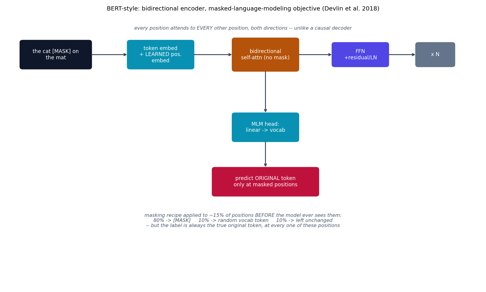

# BERT-style -- bidirectional encoder, masked language modeling

BERT {cite}`devlin2019bert` removes the decoder entirely from
{doc}`transformer` and removes the causal mask from what's left: every
position in a BERT-style encoder attends to every other position, both
before and after it in the sequence. That bidirectionality is the whole
point, and it's incompatible with next-token prediction (a bidirectional
model can trivially "cheat" by looking at the very token it's supposed to
predict) -- so BERT is trained with a different objective instead:
masked-language-modeling.

## The equation

The attention/FFN block machinery is identical to {doc}`transformer`'s
encoder layer, with `mask=None` always (never causal):

$$
\text{Attention}(Q,K,V) = \text{softmax}\!\left(\frac{QK^\top}{\sqrt{d_k}}\right)V
$$

Positional information is a **learned** embedding table
$E_{\text{pos}}[0..T{-}1]$ added to the token embedding -- one of BERT's
actual design choices (paper Sec. 3.1), not an architectural necessity,
and a deliberate contrast with {doc}`transformer`'s fixed sinusoidal
scheme. The masked-language-modeling recipe, applied to a random ~15% of
positions in every training example:

$$
\text{token}_i \to \begin{cases}\texttt{[MASK]} & \text{80%} \\ \text{random vocab token} & \text{10%} \\ \text{unchanged} & \text{10%}\end{cases}, \qquad \text{label always} = \text{original token}_i
$$

The 80/10/10 split exists so the model never *only* sees `[MASK]` during
training (which would create a train/inference mismatch, since real text
at inference time never contains `[MASK]`) -- 10% of chosen positions
stay completely unchanged in the input, forcing the model to build a
genuine contextual representation rather than only ever reacting to the
literal mask token.

## How it's built

`MLMDataset.__getitem__` in
[`models/bert/example.py`](https://github.com/agpoks/transformer-playground/blob/main/models/bert/example.py)
implements the recipe exactly:

```python
for i in range(len(ids)):
    if random.random() < self.mask_prob:
        labels[i] = ids[i]
        r = random.random()
        if r < 0.8:
            input_ids[i] = self.vocab.stoi[MASK]
        elif r < 0.9:
            input_ids[i] = random.randrange(len(self.vocab))
        # else: 10% unchanged, input_ids[i] already == ids[i]
```

`EncoderLayer.forward` in
[`models/bert/model.py`](https://github.com/agpoks/transformer-playground/blob/main/models/bert/model.py)
is the same residual/FFN shape as {doc}`transformer`'s encoder, but
`mask=None` is hard-coded, never conditional:

```python
def forward(self, x):
    x = self.norm1(x + self.drop(self.self_attn(x, x, x, mask=None)))  # bidirectional, always
    x = self.norm2(x + self.drop(self.ff(x)))
    return x
```

`BERTModel` embeds tokens and adds a learned positional embedding, stacks
`N` `EncoderLayer`s, and projects to vocabulary size with an `mlm_head` --
only the loss computation in `example.py` (via `ignore_index=-100` on
unmasked positions) restricts the training signal to the chosen ~15%.
`MultiHeadAttention`/`FeedForward` are deliberately re-implemented here
rather than imported from `models/transformer/` -- every model directory
in this repo is self-contained, the same convention used e.g. between
`odenet`/`liquidode` in `cnn-playground`.



```{eval-rst}
.. plot::

    from transformer_playground.utils.diagrams import new_ax, box, arrow, INPUT, LINEAR, NONLIN, STATE, OTHER, ATTN

    fig, ax = new_ax(figsize=(12.5, 7.5), xlim=(0, 19), ylim=(0, 12))

    box(ax, 2.0, 10.2, 2.8, 1.2, "the cat [MASK] on\nthe mat", INPUT)
    box(ax, 6.2, 10.2, 2.6, 1.2, "token embed\n+ LEARNED pos.\nembed", LINEAR)
    box(ax, 10.4, 10.2, 2.6, 1.4, "bidirectional\nself-attn (no mask)", ATTN)
    box(ax, 14.2, 10.2, 2.2, 1.0, "FFN\n+residual/LN", NONLIN)
    box(ax, 17.2, 10.2, 1.5, 1.0, "x N", OTHER)

    arrow(ax, (3.4, 10.2), (4.9, 10.2))
    arrow(ax, (7.5, 10.2), (9.1, 10.2))
    arrow(ax, (11.7, 10.2), (13.1, 10.2))
    arrow(ax, (15.3, 10.2), (16.45, 10.2))

    box(ax, 10.4, 7.0, 2.6, 1.2, "MLM head:\nlinear -> vocab", LINEAR)
    box(ax, 10.4, 4.6, 4.2, 1.2, "predict ORIGINAL token\nonly at masked positions", STATE)
    arrow(ax, (10.4, 9.5), (10.4, 7.6))
    arrow(ax, (10.4, 6.4), (10.4, 5.2))

    ax.text(9.5, 2.6,
            "masking recipe applied to ~15% of positions BEFORE the model ever sees them:\n"
            "80% -> [MASK]     10% -> random vocab token     10% -> left unchanged\n"
            "-- but the label is always the true original token, at every one of these positions",
            fontsize=9, ha="center", color="#475569", style="italic")

    ax.text(9.5, 11.3,
            "every position attends to EVERY other position, both directions -- unlike a causal decoder",
            fontsize=9, ha="center", color="#475569", style="italic")

    ax.set_title("BERT-style: bidirectional encoder, masked-language-modeling objective (Devlin et al. 2018)", fontsize=11)
```

## Simplifications vs. the paper

- **MLM only** -- BERT's second pretraining task (Next Sentence
  Prediction, over a sentence pair with a `[SEP]` token and segment
  embeddings) is omitted, along with any downstream fine-tuning head.
  Single-sentence MLM alone is enough to demonstrate what bidirectional
  attention buys you over a causal mask.
- **Scale**: `d_model=128`, 4 heads, 2 layers vs. BERT-base's
  `d_model=768`, 12 heads, 12 layers -- CPU-training-speed motivated.
- **Tokenizer**: a from-scratch word-level vocabulary, not BERT's
  WordPiece subword tokenizer.
- **Dataset size**: a subset of real WikiText-2, not the full corpus (let
  alone BooksCorpus + Wikipedia, the paper's actual pretraining data).

## Try it

```bash
python models/bert/example.py --device auto     # real WikiText-2
```

or open [`models/bert/example.ipynb`](https://github.com/agpoks/transformer-playground/blob/main/models/bert/example.ipynb).
Full runnable code: [`models/bert/model.py`](https://github.com/agpoks/transformer-playground/blob/main/models/bert/model.py) ·
[`models/bert/README.md`](https://github.com/agpoks/transformer-playground/blob/main/models/bert/README.md).

## References

```{eval-rst}
.. bibliography::
   :filter: docname in docnames
```
