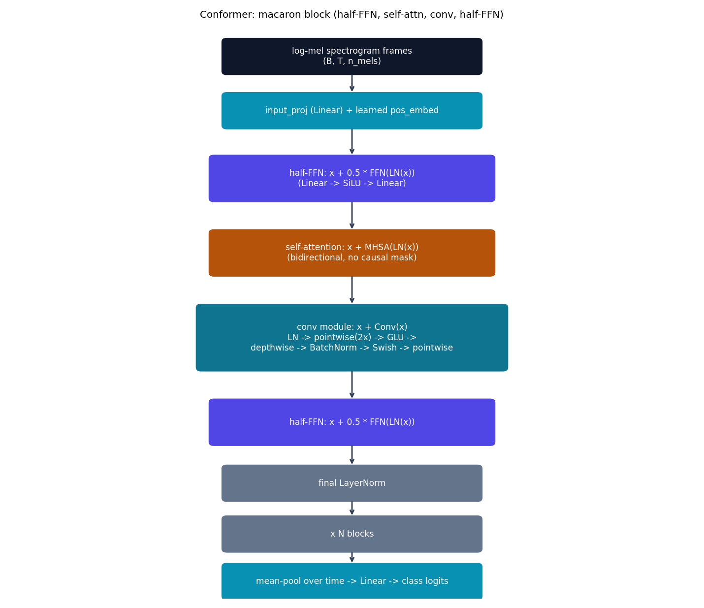

# Conformer -- convolution-augmented Transformer

Conformer {cite}`gulati2020conformer` doesn't pick between attention and
convolution -- it combines them in one block, on the idea that global
self-attention and a local, fixed-kernel convolution capture genuinely
different kinds of structure in an audio signal. It's the only model in
this repo whose attention block has a real learned convolution built into
it (the same CNN+attention hybrid theme as CoAtNet, applied here to audio).

## The equation

Each Conformer block is a "macaron" sandwich (named after the Macaron-Net
idea it borrows): a half-weighted feed-forward on either side of a
self-attention module and a convolution module, four sublayers total, each
with its own residual connection:

$$
\begin{aligned}
x &\leftarrow x + \tfrac{1}{2}\,\mathrm{FFN}(\mathrm{LN}(x)) \\
x &\leftarrow x + \mathrm{MHSA}(\mathrm{LN}(x)) \\
x &\leftarrow x + \mathrm{Conv}(x) \\
x &\leftarrow x + \tfrac{1}{2}\,\mathrm{FFN}(\mathrm{LN}(x)) \\
x &\leftarrow \mathrm{LN}(x)
\end{aligned}
$$

The $\tfrac{1}{2}$ factor on both feed-forwards is a real, specific,
checkable detail from the paper -- not a normal FFN with an accidental
scale. The convolution module itself is its own specific sequence:

$$
\mathrm{Conv}(x) = \mathrm{PW}_2\bigl(\mathrm{Swish}(\mathrm{BN}(\mathrm{DW}(\mathrm{GLU}(\mathrm{PW}_1(\mathrm{LN}(x))))))\bigr)
$$

pointwise conv (expanding channels 2x) $\to$ GLU (gates half the expanded
channels with the other half) $\to$ depthwise conv (the actual local,
per-channel receptive field) $\to$ BatchNorm $\to$ Swish $\to$ pointwise
conv back down to $d_{\text{model}}$.

## How it's built

`ConvModule` in
[`models/conformer/model.py`](https://github.com/agpoks/transformer-playground/blob/main/models/conformer/model.py)
is that exact sequence, operating on `(B, T, C)` by transposing to
`(B, C, T)` for the `nn.Conv1d` layers:

```python
def forward(self, x):
    x = self.norm(x)
    x = x.transpose(1, 2)          # (B, C, T)
    x = self.pointwise1(x)         # (B, 2C, T)
    x = F.glu(x, dim=1)            # (B, C, T)
    x = self.depthwise(x)
    x = self.bn(x)
    x = F.silu(x)
    x = self.pointwise2(x)
    x = self.drop(x)
    return x.transpose(1, 2)       # (B, T, C)
```

`ConformerBlock` chains the macaron ordering above; `MultiHeadSelfAttention`
is bidirectional (no causal mask -- Conformer is used as an ASR *encoder*
over a whole utterance, unlike {doc}`gpt`'s causal decoder self-attention).
`ConformerModel` projects log-mel spectrogram frames to `d_model`, adds a
learned positional embedding, stacks `n_layers` `ConformerBlock`s, and
mean-pools over time into a classification head.



```{eval-rst}
.. plot::

    from transformer_playground.utils.diagrams import new_ax, box, arrow, INPUT, LINEAR, NONLIN, STATE, OTHER, ATTN

    CONV = "#0e7490"

    fig, ax = new_ax(figsize=(11.0, 9.5), xlim=(0, 16), ylim=(0, 17))

    box(ax, 8.0, 16.0, 6.0, 1.0, "log-mel spectrogram frames\n(B, T, n_mels)", INPUT)
    box(ax, 8.0, 14.4, 6.0, 1.0, "input_proj (Linear) + learned pos_embed", LINEAR)

    box(ax, 8.0, 12.4, 6.6, 1.3, "half-FFN: x + 0.5 * FFN(LN(x))\n(Linear -> SiLU -> Linear)", NONLIN)
    box(ax, 8.0, 10.2, 6.6, 1.3, "self-attention: x + MHSA(LN(x))\n(bidirectional, no causal mask)", ATTN)
    box(ax, 8.0, 7.7, 7.2, 1.9, "conv module: x + Conv(x)\nLN -> pointwise(2x) -> GLU ->\ndepthwise -> BatchNorm -> Swish -> pointwise", CONV)
    box(ax, 8.0, 5.2, 6.6, 1.3, "half-FFN: x + 0.5 * FFN(LN(x))", NONLIN)
    box(ax, 8.0, 3.4, 6.0, 1.0, "final LayerNorm", OTHER)
    box(ax, 8.0, 1.9, 6.0, 1.0, "x N blocks", OTHER)
    box(ax, 8.0, 0.5, 6.0, 1.0, "mean-pool over time -> Linear -> class logits", LINEAR)

    arrow(ax, (8.0, 15.5), (8.0, 14.9))
    arrow(ax, (8.0, 13.9), (8.0, 13.05))
    arrow(ax, (8.0, 11.75), (8.0, 10.85))
    arrow(ax, (8.0, 9.55), (8.0, 8.65))
    arrow(ax, (8.0, 6.75), (8.0, 5.85))
    arrow(ax, (8.0, 4.55), (8.0, 3.9))
    arrow(ax, (8.0, 2.9), (8.0, 2.4))
    arrow(ax, (8.0, 1.4), (8.0, 1.0))

    ax.set_title("Conformer: macaron block (half-FFN, self-attn, conv, half-FFN)", fontsize=11)
```

## Simplifications vs. the paper

- **Positional encoding**: a learned absolute positional embedding (same
  idea as {doc}`bert`'s), not the original's Transformer-XL-style
  *relative* positional encoding inside self-attention -- stated here
  explicitly rather than silently swapped in.
- **Scale**: `d_model=96`, 4 heads, 3 layers, conv kernel 15 here, vs. the
  paper's much larger ASR configurations -- CPU-training-speed motivated,
  same as every other model in this repo.
- **Task**: keyword classification (core 10 Speech Commands words) rather
  than full sequence-to-sequence speech recognition (CTC/transducer
  decoding) -- the paper's actual task -- to keep the example runnable and
  quick on CPU while still exercising every architectural piece (macaron
  FFNs, bidirectional self-attention, the real conv module).
- **Dataset subset**: `transformer_playground.data.load_speech_commands`
  caps clips per class (200 train / 50 test by default) for CPU-training
  speed, using the dataset's own real `testing_list.txt` split for test
  regardless -- documented in the loader's own docstring, same honest-
  subset pattern used for {doc}`perceiver`'s CIFAR-10 run.
- **Audio I/O**: this environment's `torchaudio.load()` routes through
  TorchCodec, which needs system ffmpeg shared libraries not present here
  -- `.wav` files (plain 16kHz mono 16-bit PCM) are read directly with
  Python's built-in `wave` module instead; `torchaudio.transforms`
  (MelSpectrogram, AmplitudeToDB) are pure tensor ops and unaffected.

## Try it

```bash
python models/conformer/example.py --device auto
```

or open [`models/conformer/example.ipynb`](https://github.com/agpoks/transformer-playground/blob/main/models/conformer/example.ipynb).
Full runnable code: [`models/conformer/model.py`](https://github.com/agpoks/transformer-playground/blob/main/models/conformer/model.py) ·
[`models/conformer/README.md`](https://github.com/agpoks/transformer-playground/blob/main/models/conformer/README.md).

## References

```{eval-rst}
.. bibliography::
   :filter: docname in docnames
```
