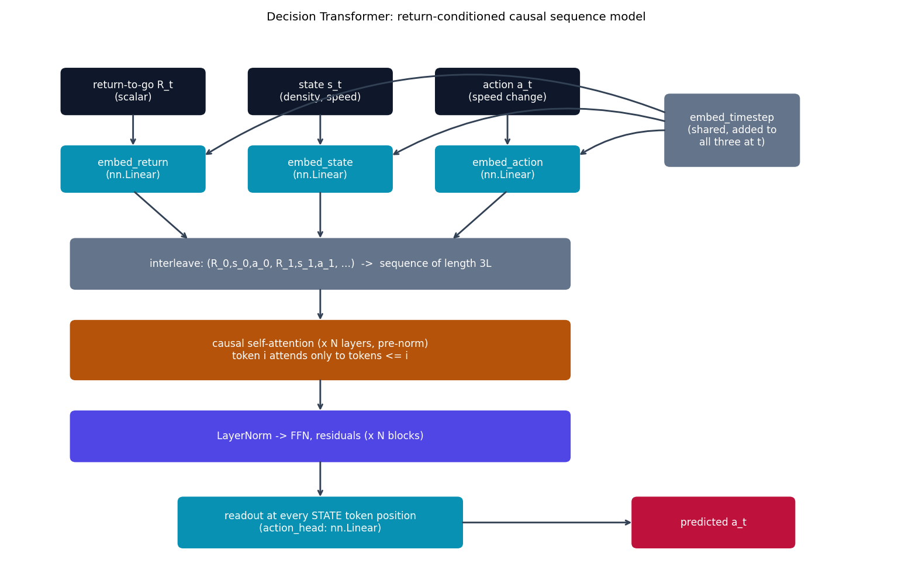

# Decision Transformer -- control as sequence modeling

Decision Transformer {cite}`chen2021decisiontransformer` casts control as
**return-conditioned sequence modeling**: instead of fitting a value
function or a policy gradient, an ordinary causal transformer sees an
interleaved sequence of (return-to-go, state, action) tokens and is
trained to predict the next action -- conditioned on a *target* return
supplied up front, so behavior is steered by asking for a return, not by
re-optimizing anything at inference time.

**Honesty note, up front**: this repo has no per-vehicle RL-labeled control
dataset. What's used instead is the real NGSIM US-101 macroscopic traffic
field already validated in `sciml-playground` (density-like and
speed-like channels, binned from real vehicle observations -- see
{doc}`../datasets`), reinterpreted here as an offline-imitation control
dataset: one spatial bin's time series becomes one "trajectory" --
state$_t$ = (density$_t$, speed$_t$), action$_t$ = the *observed* speed
change $\text{speed}_{t+1}-\text{speed}_t$ (a proxy control input), reward
$= -(v_{\text{free}} - \text{speed}_t)^2$ against a 95th-percentile
free-flow-speed target. This is this repo's own explicit data adaptation,
**not** literally reward-labeled RL data -- the transformer *mechanism*
below is implemented exactly as the paper defines it.

## The equation

At each timestep $t$, three tokens are formed by three **separate**
learned linear embeddings (not a shared table -- a real, specific design
choice from the paper) plus one shared learned timestep embedding
$p_t$:

$$
\hat{R}_t = W_R R_t + p_t, \qquad \hat{s}_t = W_s s_t + p_t, \qquad \hat{a}_t = W_a a_t + p_t
$$

These are interleaved into one sequence
$(\hat{R}_0, \hat{s}_0, \hat{a}_0, \hat{R}_1, \hat{s}_1, \hat{a}_1, \dots)$
of length $3L$ and passed through an ordinary causal transformer (same
scaled dot-product attention as {doc}`gpt`, causal-masked). The predicted
action $\hat{a}_t$ is read out from the hidden state at **the state
token's position** -- the paper's actual readout point, not the action
token's own position (which would leak $a_t$ trivially).

## How it's built

`DecisionTransformerModel.forward` in
[`models/decisiontransformer/model.py`](https://github.com/agpoks/transformer-playground/blob/main/models/decisiontransformer/model.py)
builds the three embeddings, interleaves them, and reads out at every
third position:

```python
def forward(self, returns_to_go, states, actions):
    b, length, _ = states.shape
    t_embed = self.embed_timestep(torch.arange(length, device=states.device))

    r = self.embed_return(returns_to_go) + t_embed
    s = self.embed_state(states) + t_embed
    a = self.embed_action(actions) + t_embed

    tokens = torch.stack([r, s, a], dim=2).reshape(b, 3 * length, self.d_model)
    x = self.drop(tokens)
    for block in self.blocks:
        x = block(x)
    x = self.norm_f(x)

    state_positions = x[:, 1::3, :]   # every state token's position
    return self.action_head(state_positions)
```

`build_control_trajectories` (same file) is the honest NGSIM-to-control
adaptation described above: it masks out any timestep with no real
vehicle observation (density $=0$ means *no data*, not *stopped
traffic*), and only samples fixed-length context windows where every
step is a genuine observation.



```{eval-rst}
.. plot::

    from transformer_playground.utils.diagrams import new_ax, box, arrow, INPUT, LINEAR, NONLIN, STATE, OTHER, ATTN

    fig, ax = new_ax(figsize=(12.0, 7.6), xlim=(0, 19), ylim=(0, 12.5))

    box(ax, 2.6, 11.0, 3.0, 1.0, "return-to-go R_t\n(scalar)", INPUT)
    box(ax, 6.6, 11.0, 3.0, 1.0, "state s_t\n(density, speed)", INPUT)
    box(ax, 10.6, 11.0, 3.0, 1.0, "action a_t\n(speed change)", INPUT)

    box(ax, 2.6, 9.2, 3.0, 1.0, "embed_return\n(nn.Linear)", LINEAR)
    box(ax, 6.6, 9.2, 3.0, 1.0, "embed_state\n(nn.Linear)", LINEAR)
    box(ax, 10.6, 9.2, 3.0, 1.0, "embed_action\n(nn.Linear)", LINEAR)

    box(ax, 15.4, 10.1, 2.8, 1.6, "embed_timestep\n(shared, added to\nall three at t)", OTHER)

    arrow(ax, (2.6, 10.5), (2.6, 9.7))
    arrow(ax, (6.6, 10.5), (6.6, 9.7))
    arrow(ax, (10.6, 10.5), (10.6, 9.7))
    arrow(ax, (14.0, 10.1), (12.1, 9.5), curve=0.15)
    arrow(ax, (14.0, 10.3), (8.1, 9.5), curve=0.2)
    arrow(ax, (14.0, 10.5), (4.1, 9.5), curve=0.25)

    box(ax, 6.6, 7.0, 10.6, 1.1, "interleave: (R_0,s_0,a_0, R_1,s_1,a_1, ...)  ->  sequence of length 3L", OTHER)
    arrow(ax, (2.6, 8.7), (3.8, 7.55))
    arrow(ax, (6.6, 8.7), (6.6, 7.55))
    arrow(ax, (10.6, 8.7), (9.4, 7.55))

    box(ax, 6.6, 5.0, 10.6, 1.3, "causal self-attention (x N layers, pre-norm)\ntoken i attends only to tokens <= i", ATTN)
    arrow(ax, (6.6, 6.45), (6.6, 5.65))

    box(ax, 6.6, 3.0, 10.6, 1.1, "LayerNorm -> FFN, residuals (x N blocks)", NONLIN)
    arrow(ax, (6.6, 4.35), (6.6, 3.55))

    box(ax, 6.6, 1.0, 6.0, 1.1, "readout at every STATE token position\n(action_head: nn.Linear)", LINEAR)
    arrow(ax, (6.6, 2.45), (6.6, 1.55))

    box(ax, 15.0, 1.0, 3.4, 1.1, "predicted a_t", STATE)
    arrow(ax, (9.6, 1.0), (13.3, 1.0))

    ax.set_title("Decision Transformer: return-conditioned causal sequence model", fontsize=11)
```

## Simplifications vs. the paper

- **Data adaptation (the big one)**: as stated above, NGSIM's aggregate
  traffic field is not a per-agent RL trajectory dataset. Action, reward,
  and return-to-go here are this repo's own honest construction, not
  measured/labeled RL quantities. The paper's own experiments use real
  RL benchmark trajectories (Atari, MuJoCo, Key-to-Door).
- **Train/test split by spatial bin, not by time**: checked empirically,
  splitting by time left as few as ~11 valid training windows (real
  vehicle observation coverage is uneven across the recording), so the
  first ~80% of *spatial bins*' trajectories are train and the rest are
  test, each using its full real time range.
- **No discrete-return-bucket/beam-search planner** (that's Trajectory
  Transformer, Janner et al. 2021, arXiv:2106.02039 -- a closely related
  paper *not* built here; Decision Transformer was chosen instead as the
  simpler, more canonical mechanism, needing no discretization or
  beam-search machinery).
- Scale (`d_model=64`, 3 layers) and dataset size, same CPU-speed
  motivation as every other model in this repo.

## Try it

```bash
python models/decisiontransformer/example.py --device auto --epochs 10
```

or open [`models/decisiontransformer/example.ipynb`](https://github.com/agpoks/transformer-playground/blob/main/models/decisiontransformer/example.ipynb).
Full runnable code: [`models/decisiontransformer/model.py`](https://github.com/agpoks/transformer-playground/blob/main/models/decisiontransformer/model.py) ·
[`models/decisiontransformer/README.md`](https://github.com/agpoks/transformer-playground/blob/main/models/decisiontransformer/README.md).

## References

```{eval-rst}
.. bibliography::
   :filter: docname in docnames
```
