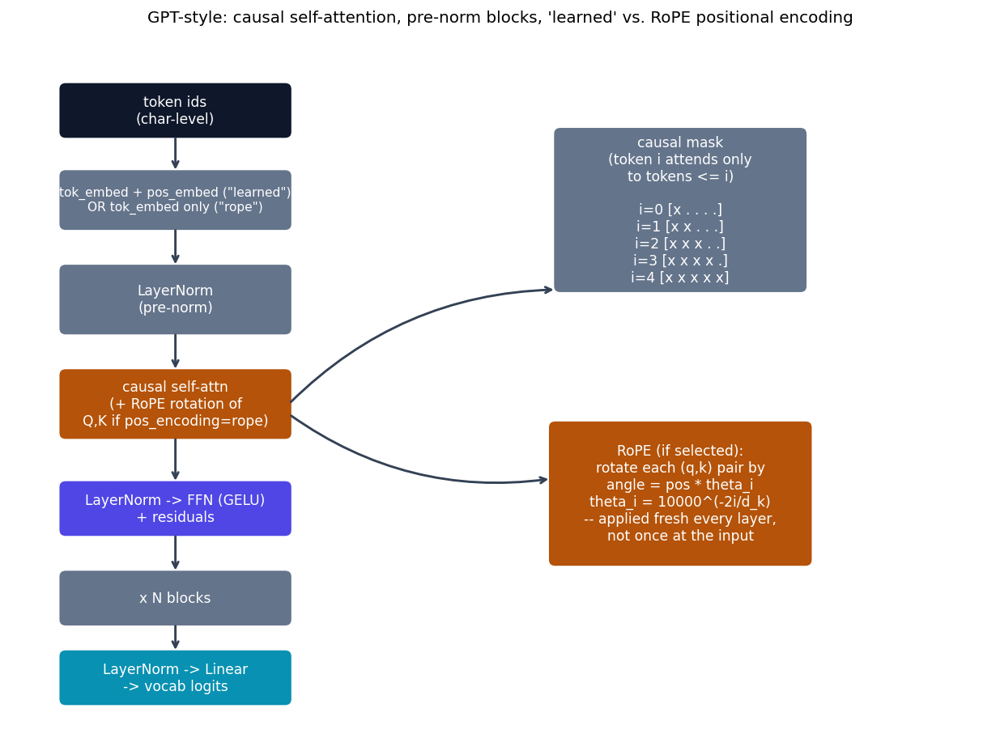

# GPT-style -- causal self-attention, decoder-only

GPT {cite}`radford2018gpt,radford2019gpt2` removes the encoder and
cross-attention entirely and keeps only a **causal** self-attention: token
$i$ attends to tokens $\le i$ only, trained to predict token $i+1$ given
everything before it (ordinary autoregressive language modeling). Where
{doc}`bert` asks "what if attention is only ever bidirectional?", this
model is the other half of that split.

## The equation

Same scaled dot-product/multi-head attention as {doc}`transformer`, but
with the mask $M$ always set to $-\infty$ above the diagonal (never zero):

$$
\text{scores}_{ij} = \frac{q_i \cdot k_j}{\sqrt{d_k}} + \begin{cases} 0 & j \le i \\ -\infty & j > i \end{cases}
$$

Positional encoding is a constructor flag with two real, different
mechanisms:

**`"learned"`** (GPT-2's actual choice): a plain embedding table indexed by
absolute position, added once at the input -- identical in spirit to
{doc}`bert`'s learned positional embedding.

**`"rope"`** ({cite}`su2021roformer`, not part of the original GPT-2 paper
-- added here as the modern alternative nearly every current LLM actually
uses): each attention head's query/key vectors are *rotated*, fresh inside
every layer, by an angle proportional to position:

$$
\text{RoPE}(x, \text{pos}) = x \odot \cos(\text{pos}\,\theta) + \text{rotate\_half}(x) \odot \sin(\text{pos}\,\theta), \qquad \theta_i = 10000^{-2i/d_k}
$$

where $\text{rotate\_half}$ splits $x$ into two halves and returns
$(-x_2, x_1)$. Because this is a *rotation* applied identically to $q$ and
$k$, the dot product $q_i \cdot k_j$ after rotation depends only on the
*relative* position $i-j$, not on $i$ and $j$ separately -- a relative
positional signal that falls out of an absolute-looking operation, with no
learned table and no fixed maximum sequence length baked into the model's
parameters.

This repo also uses **pre-norm** blocks (LayerNorm *before* each sublayer,
residual add after) -- GPT-2's real choice, contrasted with
{doc}`transformer`'s post-norm.

## How it's built

`CausalSelfAttention` in
[`models/gpt/model.py`](https://github.com/agpoks/transformer-playground/blob/main/models/gpt/model.py)
applies RoPE to $q,k$ (only when selected) right before the masked
softmax:

```python
def forward(self, x):
    b, t, d_model = x.shape
    q = self._split_heads(self.w_q(x))
    k = self._split_heads(self.w_k(x))
    v = self._split_heads(self.w_v(x))

    if self.pos_encoding == "rope":
        cos, sin = rope_cos_sin(t, self.d_k, x.device)
        q = apply_rope(q, cos, sin)
        k = apply_rope(k, cos, sin)

    scores = q @ k.transpose(-2, -1) / math.sqrt(self.d_k)
    scores = scores.masked_fill(causal_mask(t, x.device), float("-inf"))
    weights = torch.softmax(scores, dim=-1)
    out = (weights @ v).transpose(1, 2).contiguous().view(b, t, d_model)
    return self.w_o(out)
```

`GPTBlock` is pre-norm (`x = x + attn(norm(x)); x = x + ff(norm(x))`);
`GPTModel` stacks `n_layers` of these over a token embedding (plus a
learned positional embedding, only in `"learned"` mode) and a final
`LayerNorm` + linear projection to vocabulary logits.



```{eval-rst}
.. plot::

    from transformer_playground.utils.diagrams import new_ax, box, arrow, INPUT, LINEAR, NONLIN, STATE, OTHER, ATTN

    fig, ax = new_ax(figsize=(12.0, 8.6), xlim=(0, 19), ylim=(-0.5, 13.5))

    box(ax, 3.2, 11.9, 4.4, 1.0, "token ids\n(char-level)", INPUT)
    box(ax, 3.2, 10.1, 4.4, 1.1, "tok_embed + pos_embed (\"learned\")\nOR tok_embed only (\"rope\")", OTHER, fontsize=8.5)
    box(ax, 3.2, 8.1, 4.4, 1.3, "LayerNorm\n(pre-norm)", OTHER)
    box(ax, 3.2, 6.0, 4.4, 1.3, "causal self-attn\n(+ RoPE rotation of\nQ,K if pos_encoding=rope)", ATTN)
    box(ax, 3.2, 3.9, 4.4, 1.0, "LayerNorm -> FFN (GELU)\n+ residuals", NONLIN)
    box(ax, 3.2, 2.1, 4.4, 1.0, "x N blocks", OTHER)
    box(ax, 3.2, 0.5, 4.4, 1.0, "LayerNorm -> Linear\n-> vocab logits", LINEAR)

    arrow(ax, (3.2, 11.4), (3.2, 10.65))
    arrow(ax, (3.2, 9.55), (3.2, 8.75))
    arrow(ax, (3.2, 7.45), (3.2, 6.65))
    arrow(ax, (3.2, 5.35), (3.2, 4.4))
    arrow(ax, (3.2, 3.4), (3.2, 2.6))
    arrow(ax, (3.2, 1.6), (3.2, 1.0))

    box(ax, 13.0, 9.9, 4.8, 3.2, "causal mask\n(token i attends only\nto tokens <= i)\n\ni=0 [x . . . .]\ni=1 [x x . . .]\ni=2 [x x x . .]\ni=3 [x x x x .]\ni=4 [x x x x x]", OTHER)
    arrow(ax, (5.4, 6.0), (10.6, 8.3), curve=-0.2)

    box(ax, 13.0, 4.2, 5.0, 2.8, "RoPE (if selected):\nrotate each (q,k) pair by\nangle = pos * theta_i\ntheta_i = 10000^(-2i/d_k)\n-- applied fresh every layer,\nnot once at the input", ATTN)
    arrow(ax, (5.4, 5.8), (10.5, 4.5), curve=0.2)

    ax.set_title("GPT-style: causal self-attention, pre-norm blocks, 'learned' vs. RoPE positional encoding", fontsize=11)
```

## Simplifications vs. the paper

- **Scale**: `d_model=128`, 4 heads, 4 layers here, vs. GPT-2's much
  larger configurations -- CPU-training-speed motivated, same as every
  other model in this repo.
- **Tokenizer**: character-level (vocab = the corpus's unique
  characters), not GPT-2's byte-pair-encoding subword tokenizer.
- **Dataset**: Tiny Shakespeare (~1MB), not GPT-2's WebText.
- RoPE is included as an alternative positional-encoding mode, not part of
  the original GPT-2 paper -- flagged as such above, cited separately.

## Try it

```bash
python models/gpt/example.py --device auto --pos-encoding learned
python models/gpt/example.py --device auto --pos-encoding rope
```

or open [`models/gpt/example.ipynb`](https://github.com/agpoks/transformer-playground/blob/main/models/gpt/example.ipynb).
Full runnable code: [`models/gpt/model.py`](https://github.com/agpoks/transformer-playground/blob/main/models/gpt/model.py) ·
[`models/gpt/README.md`](https://github.com/agpoks/transformer-playground/blob/main/models/gpt/README.md).

## References

```{eval-rst}
.. bibliography::
   :filter: docname in docnames
```
