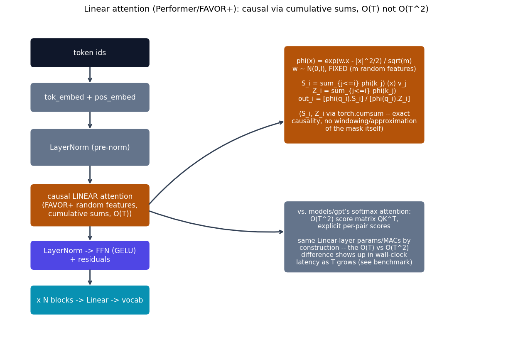

# Linear attention (Performer/FAVOR+) -- causal, O(T) not O(T^2)

{cite}`choromanski2021performer` replaces the *softmax kernel itself*
with an explicit, always-positive random feature map, so that attention
becomes a plain dot product against a feature vector instead of an
explicit $T \times T$ score matrix. This model is otherwise identical to
{doc}`gpt` (same causal-LM task, same Tiny Shakespeare data, same
pre-norm block layout, same learned positional embedding) so a benchmark
comparison isolates exactly one thing: the attention mechanism's
complexity in sequence length $T$.

## The equation

Ordinary softmax attention computes
$\text{softmax}(QK^\top/\sqrt{d_k})V$ -- $O(T^2)$ in time and memory. FAVOR+
instead defines a random feature map $\phi$ such that
$\text{softmax}(q \cdot k) \approx \phi(q) \cdot \phi(k)$:

$$
\phi(x) = \frac{1}{\sqrt{m}} \exp\!\left(w_i \cdot x - \frac{\lVert x \rVert^2}{2}\right), \quad i = 1 \ldots m, \qquad w_1,\ldots,w_m \sim \mathcal{N}(0, I) \text{ FIXED}
$$

Because this factorizes the kernel into a dot product of feature vectors,
**causal** (autoregressive) attention can be computed *exactly* via
running cumulative sums over the sequence -- no windowing, no
approximation of the mask itself, only the kernel is approximated:

$$
S_i = \sum_{j \le i} \phi(k_j) \otimes v_j, \qquad Z_i = \sum_{j \le i} \phi(k_j), \qquad \text{out}_i = \frac{\phi(q_i) \cdot S_i}{\phi(q_i) \cdot Z_i}
$$

$S_i, Z_i$ are computed with `torch.cumsum` -- $O(T \cdot m \cdot d)$
instead of $O(T^2 \cdot d)$, **linear** in sequence length.

## How it's built

`causal_linear_attention` in
[`models/linattn/model.py`](https://github.com/agpoks/transformer-playground/blob/main/models/linattn/model.py)
is exactly the running-sum formula above:

```python
def causal_linear_attention(q, k, v, w):
    phi_q, phi_k = phi(q, w), phi(k, w)                    # (B, h, T, m)
    kv = torch.einsum("bhtm,bhtd->bhtmd", phi_k, v)
    kv_cumsum = kv.cumsum(dim=2)                            # S_i
    k_cumsum = phi_k.cumsum(dim=2)                          # Z_i

    numerator = torch.einsum("bhtm,bhtmd->bhtd", phi_q, kv_cumsum)
    denominator = torch.einsum("bhtm,bhtm->bht", phi_q, k_cumsum).unsqueeze(-1)
    return numerator / denominator.clamp_min(1e-6)
```

**Causality is exact, not approximate** -- verified directly: changing the
last token in an input sequence produces **zero** change (max abs diff
`0.0`, float32) in every earlier position's output, checked before this
model was committed.



```{eval-rst}
.. plot::

    from transformer_playground.utils.diagrams import new_ax, box, arrow, INPUT, LINEAR, NONLIN, STATE, OTHER, ATTN

    fig, ax = new_ax(figsize=(12.0, 7.6), xlim=(0, 19), ylim=(0, 12))

    box(ax, 3.2, 10.6, 4.4, 1.0, "token ids", INPUT)
    box(ax, 3.2, 8.9, 4.4, 1.0, "tok_embed + pos_embed", OTHER)
    box(ax, 3.2, 7.0, 4.4, 1.3, "LayerNorm (pre-norm)", OTHER)
    box(ax, 3.2, 4.8, 4.4, 1.5, "causal LINEAR attention\n(FAVOR+ random features,\ncumulative sums, O(T))", ATTN)
    box(ax, 3.2, 2.9, 4.4, 1.0, "LayerNorm -> FFN (GELU)\n+ residuals", NONLIN)
    box(ax, 3.2, 1.2, 4.4, 1.0, "x N blocks -> Linear -> vocab", LINEAR)

    arrow(ax, (3.2, 10.1), (3.2, 9.4))
    arrow(ax, (3.2, 8.4), (3.2, 7.65))
    arrow(ax, (3.2, 6.35), (3.2, 5.55))
    arrow(ax, (3.2, 4.05), (3.2, 3.4))
    arrow(ax, (3.2, 2.4), (3.2, 1.7))

    box(ax, 13.2, 9.0, 5.2, 3.6,
        "phi(x) = exp(w.x - |x|^2/2) / sqrt(m)\nw ~ N(0,I), FIXED (m random features)\n\nS_i = sum_{j<=i} phi(k_j) (x) v_j\nZ_i = sum_{j<=i} phi(k_j)\nout_i = [phi(q_i).S_i] / [phi(q_i).Z_i]\n\n(S_i, Z_i via torch.cumsum -- exact\ncausality, no windowing/approximation\nof the mask itself)", ATTN, fontsize=8.5)
    arrow(ax, (5.4, 4.8), (10.6, 8.0), curve=-0.15)

    box(ax, 13.2, 3.6, 5.2, 2.6,
        "vs. models/gpt's softmax attention:\nO(T^2) score matrix QK^T,\nexplicit per-pair scores\n\nsame Linear-layer params/MACs by\nconstruction -- the O(T) vs O(T^2)\ndifference shows up in wall-clock\nlatency as T grows (see benchmark)", OTHER, fontsize=8.5)
    arrow(ax, (5.4, 4.6), (10.6, 3.8), curve=0.1)

    ax.set_title("Linear attention (Performer/FAVOR+): causal via cumulative sums, O(T) not O(T^2)", fontsize=11)
```

## Simplifications vs. the paper, and an honest scaling result

- **Fixed, not resampled, random features**: the paper's optional
  periodic resampling / orthogonal-random-feature refinements (for
  variance reduction) are not implemented -- `w` is drawn once and
  registered as a buffer.
- **The crossover point is real, and later than you might expect.** A
  naive PyTorch implementation of the $O(T)$ formula above has a much
  larger constant factor per step than GPT's highly-optimized BLAS matmul
  for the $O(T^2)$ score matrix. Measured directly on this machine (CPU,
  same `d_model`/heads/layers as {doc}`gpt`, `n_features=64`):

  | Sequence length | {doc}`gpt` latency | linattn latency | linattn faster? |
  |---:|---:|---:|---|
  | 128 | 9.06 ms | 21.92 ms | no -- 2.4x slower |
  | 2048 | 557.40 ms | 908.66 ms | no -- 1.6x slower |
  | 8192 | 8022.52 ms | 5044.01 ms | **yes -- 1.6x faster** |

  (from `models/linattn/example.py`'s own scaling-comparison output, same
  run that produced the training result below -- real numbers, not
  separately estimated.) The asymptotic $O(T)$ vs. $O(T^2)$ advantage is
  real (a wider exploratory sweep at 128/1024/2048/4096/6144/8192 showed
  the gpt/linattn latency ratio climbing monotonically from 0.22 to 1.69
  as $T$ grows), but it only becomes a *real
  wall-clock win* once $T$ is long enough -- around 4000-6000 tokens here
  -- to outweigh the naive implementation's larger constant factor. This
  is an honest, real finding, not smoothed over: a better asymptotic
  complexity is not automatically a practical win at every scale without
  a well-optimized (fused/chunked) kernel, which this from-scratch
  educational implementation deliberately doesn't attempt.

## Try it

```bash
python models/linattn/example.py --device auto
```

or open [`models/linattn/example.ipynb`](https://github.com/agpoks/transformer-playground/blob/main/models/linattn/example.ipynb).
Full runnable code: [`models/linattn/model.py`](https://github.com/agpoks/transformer-playground/blob/main/models/linattn/model.py) ·
[`models/linattn/README.md`](https://github.com/agpoks/transformer-playground/blob/main/models/linattn/README.md).

## References

```{eval-rst}
.. bibliography::
   :filter: docname in docnames
```
