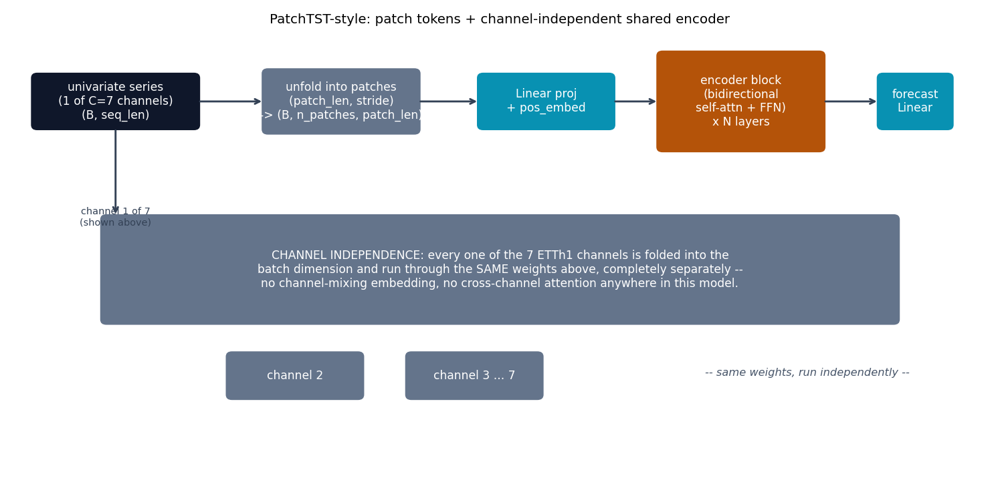

# PatchTST-style -- attention over time-series patches

PatchTST {cite}`nie2023patchtst` generalizes attention to time series the
same way ViT generalized it to images (see
[`cnn-playground`'s ViT](https://github.com/agpoks/cnn-playground/tree/main/models/vit)):
split
each univariate series into **patches** along the time axis, project each
patch to one token, and run an ordinary bidirectional (encoder-only)
transformer over patch tokens instead of one token per timestep. For a
multivariate series, every channel goes through the *same* weights,
independently -- **channel independence**, a real design choice, not an
approximation.

## The equation

A patch of length $P$ starting at offset $j\cdot S$ (stride $S$) of a
univariate series $x_{1:L}$ becomes one token via a learned linear
projection $W_p \in \mathbb{R}^{d_{model} \times P}$:

$$
\text{patch}_j = x_{jS+1 : jS+P}, \qquad z_j = W_p\, \text{patch}_j + e_j
$$

where $e_j$ is a learned per-patch-index positional embedding. The
resulting $n$ patch tokens $z_{1:n}$ are then run through ordinary
bidirectional multi-head self-attention (no mask -- forecasting sees the
entire lookback window at once, unlike autoregressive generation), and a
final linear head maps the flattened patch representations to the
$H$-step forecast:

$$
\hat{x}_{L+1:L+H} = W_{\text{head}}\, \text{flatten}\bigl(\text{Encoder}(z_{1:n})\bigr)
$$

Crucially, for a $C$-channel series, this whole pipeline runs $C$ times
with **the same** $W_p$, encoder, and $W_{\text{head}}$ -- channels are
folded into the batch dimension and never mixed.

## How it's built

`PatchEmbedding` in
[`models/patchtst/model.py`](https://github.com/agpoks/transformer-playground/blob/main/models/patchtst/model.py)
is the unfold-then-project step above:

```python
class PatchEmbedding(nn.Module):
    def __init__(self, seq_len, patch_len, stride, d_model):
        n_patches = (seq_len - patch_len) // stride + 1
        self.proj = nn.Linear(patch_len, d_model)
        self.pos_embed = nn.Parameter(torch.zeros(1, n_patches, d_model))

    def forward(self, x):
        patches = x.unfold(-1, self.patch_len, self.stride)  # (B, n_patches, patch_len)
        return self.proj(patches) + self.pos_embed
```

`PatchTSTModel.forward` is where channel independence is literally
structural, not just a training-time convention:

```python
def forward(self, x):
    """x: (B, C, seq_len)."""
    b, c, seq_len = x.shape
    x = x.reshape(b * c, seq_len)  # channels never mix -- not even present as a dim
    h = self.patch_embed(x)
    for block in self.blocks:
        h = block(h)
    ...
    return out.reshape(b, c, self.pred_len)
```



```{eval-rst}
.. plot::

    from transformer_playground.utils.diagrams import new_ax, box, arrow, INPUT, LINEAR, NONLIN, STATE, OTHER, ATTN

    fig, ax = new_ax(figsize=(11.5, 5.6), xlim=(0, 19), ylim=(0, 10))

    box(ax, 2.0, 8.4, 3.2, 1.2, "univariate series\n(1 of C=7 channels)\n(B, seq_len)", INPUT)
    box(ax, 6.4, 8.4, 3.0, 1.4, "unfold into patches\n(patch_len, stride)\n-> (B, n_patches, patch_len)", OTHER)
    box(ax, 10.4, 8.4, 2.6, 1.2, "Linear proj\n+ pos_embed", LINEAR)
    box(ax, 14.2, 8.4, 3.2, 2.2, "encoder block\n(bidirectional\nself-attn + FFN)\nx N layers", ATTN)
    box(ax, 17.6, 8.4, 1.4, 1.2, "forecast\nLinear", LINEAR)

    arrow(ax, (3.6, 8.4), (4.9, 8.4))
    arrow(ax, (7.9, 8.4), (9.1, 8.4))
    arrow(ax, (11.7, 8.4), (12.6, 8.4))
    arrow(ax, (15.8, 8.4), (16.9, 8.4))

    box(ax, 9.5, 4.6, 15.5, 2.4,
        "CHANNEL INDEPENDENCE: every one of the 7 ETTh1 channels is folded into the\n"
        "batch dimension and run through the SAME weights above, completely separately --\n"
        "no channel-mixing embedding, no cross-channel attention anywhere in this model.",
        OTHER, fontsize=9.5)
    arrow(ax, (2.0, 7.8), (2.0, 5.8), curve=0.0)
    ax.text(2.0, 5.6, "channel 1 of 7\n(shown above)", fontsize=8, ha="center", color="#334155")
    box(ax, 5.5, 2.2, 2.6, 1.0, "channel 2", OTHER)
    box(ax, 9.0, 2.2, 2.6, 1.0, "channel 3 ... 7", OTHER)
    ax.text(13.5, 2.2, "-- same weights, run independently --", fontsize=9, color="#475569", style="italic")

    ax.set_title("PatchTST-style: patch tokens + channel-independent shared encoder", fontsize=11)
```

## Simplifications vs. the paper

- **Scale**: `d_model=64`, 4 heads, 3 layers, patch_len=16/stride=8 here,
  vs. the paper's larger configurations -- CPU-training-speed motivated,
  same as every other model in this repo.
- **Instance normalization**: the paper applies RevIN (reversible instance
  normalization) per-window; this repo instead standardizes the whole
  series once using train-set statistics -- simpler, real data leakage
  risk avoided (train stats only), but not the paper's exact per-window
  scheme.
- Only ETTh1's hourly split is used here (the paper also reports ETTh2,
  ETTm1/2, electricity, weather, traffic, illness).

## Try it

```bash
python models/patchtst/example.py --device auto
```

or open [`models/patchtst/example.ipynb`](https://github.com/agpoks/transformer-playground/blob/main/models/patchtst/example.ipynb).
Full runnable code: [`models/patchtst/model.py`](https://github.com/agpoks/transformer-playground/blob/main/models/patchtst/model.py) ·
[`models/patchtst/README.md`](https://github.com/agpoks/transformer-playground/blob/main/models/patchtst/README.md).

## References

```{eval-rst}
.. bibliography::
   :filter: docname in docnames
```
