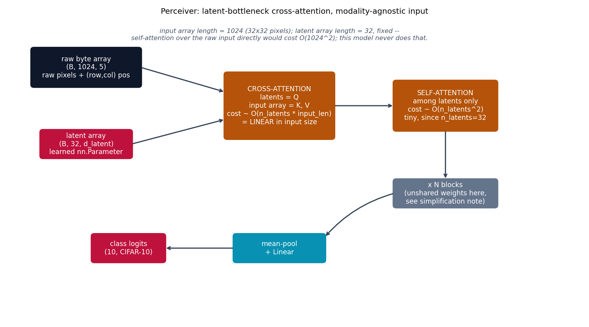

# Perceiver -- latent-bottleneck cross-attention

Perceiver {cite}`jaegle2021perceiver` answers a different generalization
question than {doc}`patchtst`: instead of shortening the input sequence by
tokenizing groups of elements together (patching), keep *every* raw input
element as its own token, but bound the **query** side of attention
instead. A small, fixed-size learned latent array repeatedly cross-attends
into the (arbitrarily large) raw input, then self-attends among itself --
cost is linear in input size, not quadratic, and no modality-specific
input structure (no convolutional patchification) is needed at all.

## The equation

Ordinary self-attention over a length-$N$ input costs $O(N^2)$. Perceiver
instead keeps a latent array $Z \in \mathbb{R}^{M \times d}$ with $M \ll N$
fixed, and computes

$$
Z' = \text{softmax}\!\left(\frac{Z W_q (X W_k)^\top}{\sqrt{d_k}}\right) X W_v, \qquad X \in \mathbb{R}^{N \times d_{in}}
$$

-- latents as queries, the raw input array $X$ as keys/values. This
**cross-attention** costs $O(M \cdot N)$, linear in $N$ since $M$ is fixed
and small (32 here, vs. $N=1024$ raw CIFAR-10 pixels). A second,
ordinary self-attention step among the latents alone,

$$
Z'' = \text{softmax}\!\left(\frac{Z' W_q' (Z' W_k')^\top}{\sqrt{d_k}}\right) Z' W_v'
$$

costs only $O(M^2)$ -- tiny, since $M$ is small. The two steps repeat for
a few blocks, refining the latent array's summary of the input each time.

## How it's built

`CrossAttention` in
[`models/perceiver/model.py`](https://github.com/agpoks/transformer-playground/blob/main/models/perceiver/model.py)
is exactly the asymmetric Q/K-V formula above -- note `w_k`/`w_v` project
from `d_input` (the raw input's own dimension), while `w_q` projects from
`d_latent`:

```python
class CrossAttention(nn.Module):
    def __init__(self, d_latent, d_input, n_heads):
        self.w_q = nn.Linear(d_latent, d_latent)
        self.w_k = nn.Linear(d_input, d_latent)
        self.w_v = nn.Linear(d_input, d_latent)
        self.w_o = nn.Linear(d_latent, d_latent)

    def forward(self, latents, inputs):
        q = self._split_heads(self.w_q(latents))   # (B, h, M, d_k) -- M = n_latents
        k = self._split_heads(self.w_k(inputs))     # (B, h, N, d_k) -- N = input_len
        v = self._split_heads(self.w_v(inputs))
        scores = q @ k.transpose(-2, -1) / math.sqrt(self.d_k)  # (B, h, M, N) -- linear in N
        ...
```

`PerceiverModel` holds the latent array as a plain `nn.Parameter`
(learned, but not input-dependent), and alternates `CrossAttention` +
`SelfAttention` for `n_layers` blocks before a mean-pool + linear
classification head.



```{eval-rst}
.. plot::

    from transformer_playground.utils.diagrams import new_ax, box, arrow, INPUT, LINEAR, NONLIN, STATE, OTHER, ATTN

    fig, ax = new_ax(figsize=(11.5, 6.4), xlim=(0, 19), ylim=(0, 11))

    box(ax, 2.6, 9.2, 3.6, 1.4, "raw byte array\n(B, 1024, 5)\nraw pixels + (row,col) pos", INPUT)
    box(ax, 2.6, 6.4, 3.0, 1.0, "latent array\n(B, 32, d_latent)\nlearned nn.Parameter", STATE)

    box(ax, 9.0, 7.8, 3.6, 2.4, "CROSS-ATTENTION\nlatents = Q\ninput array = K, V\ncost ~ O(n_latents * input_len)\n= LINEAR in input size", ATTN)
    box(ax, 14.5, 7.8, 3.4, 1.8, "SELF-ATTENTION\namong latents only\ncost ~ O(n_latents^2)\ntiny, since n_latents=32", ATTN)
    box(ax, 14.5, 4.6, 3.4, 1.0, "x N blocks\n(unshared weights here,\nsee simplification note)", OTHER)
    box(ax, 9.0, 2.6, 3.0, 1.0, "mean-pool\n+ Linear", LINEAR)
    box(ax, 4.0, 2.6, 2.4, 1.0, "class logits\n(10, CIFAR-10)", STATE)

    arrow(ax, (4.4, 9.2), (7.2, 8.3))
    arrow(ax, (4.1, 6.4), (7.2, 7.3))
    arrow(ax, (10.8, 7.8), (12.8, 7.8))
    arrow(ax, (14.5, 6.9), (14.5, 5.1))
    arrow(ax, (12.8, 4.6), (10.5, 3.0), curve=0.15)
    arrow(ax, (7.5, 2.6), (5.2, 2.6))

    ax.text(9.0, 10.2,
            "input array length = 1024 (32x32 pixels); latent array length = 32, fixed --\n"
            "self-attention over the raw input directly would cost O(1024^2); this model never does that.",
            fontsize=9, ha="center", color="#475569", style="italic")

    ax.set_title("Perceiver: latent-bottleneck cross-attention, modality-agnostic input", fontsize=11)
```

A concrete illustration of the cost difference this buys: ordinary
self-attention over the full $N=1024$-token pixel array (as {doc}`bert` or
{doc}`transformer` would do it) computes an $N \times N = 1{,}048{,}576$
score matrix per head, per layer. Perceiver's cross-attention step
computes only $M \times N = 32 \times 1024 = 32{,}768$ scores -- a 32x
reduction, growing linearly with `n_latents`/`input_len` rather than
quadratically with `input_len` alone.

## Simplifications vs. the paper

- **Unshared weights across blocks**: the paper repeats its
  cross-attend+self-attend block many times (typically 8) with the *same*
  weights reused after the first iteration -- a weight-tying scheme that
  lets it scale to very deep effective computation with few parameters.
  This repo uses `n_layers=3` *independent* (unshared) blocks instead, for
  simplicity, since the model here is already small.
- **Positional features**: the paper uses Fourier positional features;
  this repo uses a simpler raw `(row, col)` coordinate pair scaled to
  `[-1, 1]`, concatenated to the RGB values -- fewer input dimensions,
  same "attention has no idea about 2D adjacency unless told" purpose.
- **Scale**: `n_latents=32`, `d_latent=64`, 3 blocks here, vs. the paper's
  much larger configurations -- CPU-training-speed motivated, same as
  every other model in this repo.
- **Verification run size**: the number reported below trains on a real
  3,000-image/1,000-image subset of CIFAR-10 (not the full 50,000/10,000),
  because a full run did not finish in reasonable time on this machine's
  CPU under heavy unrelated load (cross-attention over a 1,024-token input
  array is genuinely expensive per step) -- `example.py --max-train
  --max-test` exist specifically for this; the full dataset is used by
  default with no flags passed.

## Try it

```bash
python models/perceiver/example.py --device auto
```

or open [`models/perceiver/example.ipynb`](https://github.com/agpoks/transformer-playground/blob/main/models/perceiver/example.ipynb).
Full runnable code: [`models/perceiver/model.py`](https://github.com/agpoks/transformer-playground/blob/main/models/perceiver/model.py) ·
[`models/perceiver/README.md`](https://github.com/agpoks/transformer-playground/blob/main/models/perceiver/README.md).

## References

```{eval-rst}
.. bibliography::
   :filter: docname in docnames
```
