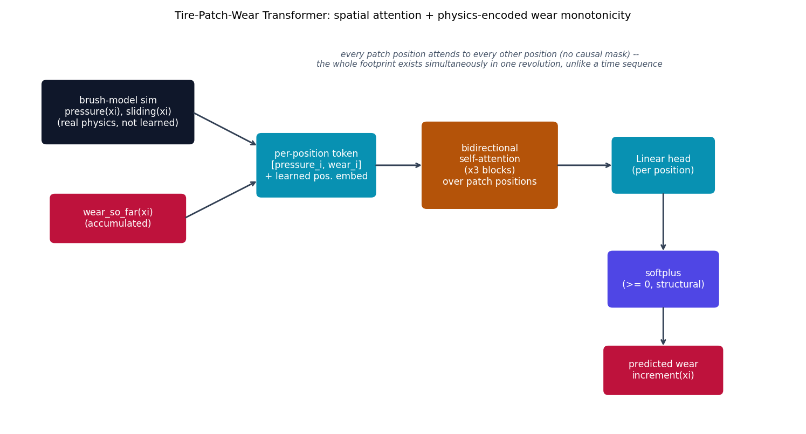
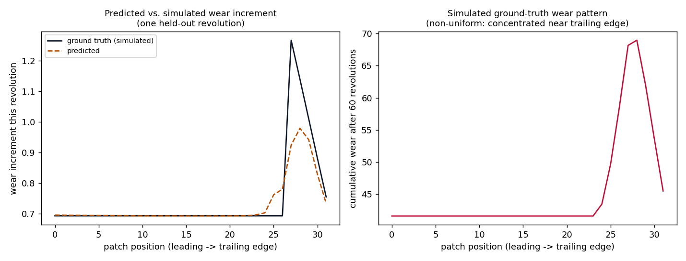

# Tire-Patch-Wear Transformer -- spatial attention + physics-encoded wear

**This is this repo's own combination, not a reproduction of a published
paper.** As far as this project's own literature search could find, no
published work applies attention/transformers to tire contact-patch wear
specifically. This model combines spatial self-attention over
patch-position tokens (the same mechanism {doc}`patchtst`'s 1D patching or
{doc}`perceiver`'s tokenization use) with real, classical tire mechanics:
the brush model of the contact patch ({cite:t}`pacejka2012tire`) and
Archard's wear law ({cite:t}`archard1953wear`). The physics-simulator
equations used to generate this model's training data are an honest
re-derivation of the real, already-implemented and tested
`tire_nn/physics/brush_patch.py` and `tire_nn/physics/wear.py` modules in
the sibling [`tire_physics_nn`](https://github.com/agpoks/tire_physics_nn)
project -- credited explicitly here, **not** imported as a code dependency
(every repo in this family stays self-contained and independently
cloneable).

## The equation

The contact patch runs from the leading edge ($\xi=0$) to the trailing
edge ($\xi=2a$). Its normal-load pressure distribution is the classical
parabolic brush-model profile, normalized to integrate to $F_z$:

$$
p(\xi) = \frac{3 F_z}{4a}\left[1 - \left(\frac{\xi - a}{a}\right)^2\right]
$$

Tread material enters undeflected at the leading edge; in the **adhesion**
region its shear stress grows linearly with distance travelled,
$\tau_{\text{adh}}(\xi) = k_b |\sigma| \xi$, until it reaches the local
friction bound $\mu\, p(\xi)$ -- beyond that point the tread **slides**,
and the stress sits exactly on the bound:

$$
\tau(\xi) = \min\bigl(k_b |\sigma| \xi,\ \mu\, p(\xi)\bigr)
$$

Archard's wear law says wear rate is proportional to normal load and
sliding distance. This repo enforces non-negativity **structurally**
(physics-*encoded*, the same invariant `tire_physics_nn`'s own
`wear_rate` uses), not as a soft loss penalty that a network could still
violate:

$$
\Delta\text{wear}(\xi) = \mathrm{softplus}\bigl(k_{\text{wear}}\, p(\xi)\, d_{\text{slide}}(\xi)\bigr) \ge 0
$$

accumulated revolution over revolution. Because $p(\xi)$ is parabolic
(peaking mid-patch, vanishing at both edges) while $\tau_{\text{adh}}(\xi)$
grows monotonically, the friction bound is first exceeded near the
**trailing** edge, not the leading edge or the patch center -- this is
what produces the non-uniform wear pattern below, not an arbitrary choice.

## How it's built

`simulate_wear_trajectory` in
[`models/tirewear/model.py`](https://github.com/agpoks/transformer-playground/blob/main/models/tirewear/model.py)
is the physics simulator; `TirePatchWearTransformer` is the model:

```python
def patch_shear(xi, pressure, slip, stiffness, mu):
    adhesion = stiffness * abs(slip) * xi
    limit = mu * pressure
    tau = torch.minimum(adhesion, limit)
    sliding = (adhesion > limit).float()
    return tau, sliding

# ... per revolution:
sliding_distance = sliding * abs(slip)
wear_inc = F.softplus(k_wear * pressure_row * sliding_distance)  # >= 0, structurally
```

```python
class TirePatchWearTransformer(nn.Module):
    def forward(self, pressure, wear_so_far):
        x = torch.stack([pressure, wear_so_far], dim=-1)   # (B, n_elements, 2)
        x = self.input_proj(x) + self.pos_embed             # per-position token
        for block in self.blocks:                           # bidirectional self-attn, no mask
            x = block(x)
        return self.head(self.norm_f(x)).squeeze(-1)         # raw logits; softplus applied by the caller
```

Every patch position attends to every other position with **no causal
mask** -- unlike a time sequence, an entire revolution's footprint exists
simultaneously; there is no "future position" to hide from a patch token.



```{eval-rst}
.. plot::

    from transformer_playground.utils.diagrams import new_ax, box, arrow, INPUT, LINEAR, NONLIN, STATE, OTHER, ATTN

    fig, ax = new_ax(figsize=(11.5, 6.2), xlim=(0, 19), ylim=(0, 10.5))

    box(ax, 2.6, 8.2, 3.6, 1.6, "brush-model sim\npressure(xi), sliding(xi)\n(real physics, not learned)", INPUT)
    box(ax, 2.6, 5.4, 3.2, 1.2, "wear_so_far(xi)\n(accumulated)", STATE)

    box(ax, 7.4, 6.8, 2.8, 1.6, "per-position token\n[pressure_i, wear_i]\n+ learned pos. embed", LINEAR)
    box(ax, 11.6, 6.8, 3.2, 2.2, "bidirectional\nself-attention\n(x3 blocks)\nover patch positions", ATTN)
    box(ax, 15.8, 6.8, 2.4, 1.4, "Linear head\n(per position)", LINEAR)
    box(ax, 15.8, 3.8, 2.6, 1.4, "softplus\n(>= 0, structural)", NONLIN)
    box(ax, 15.8, 1.4, 2.8, 1.2, "predicted wear\nincrement(xi)", STATE)

    arrow(ax, (4.4, 8.2), (6.0, 7.3))
    arrow(ax, (4.2, 5.4), (6.0, 6.4))
    arrow(ax, (8.8, 6.8), (10.0, 6.8))
    arrow(ax, (13.2, 6.8), (14.6, 6.8))
    arrow(ax, (15.8, 6.1), (15.8, 4.5))
    arrow(ax, (15.8, 3.1), (15.8, 2.0))

    ax.text(11.6, 9.4,
            "every patch position attends to every other position (no causal mask) --\n"
            "the whole footprint exists simultaneously in one revolution, unlike a time sequence",
            fontsize=8.5, ha="center", color="#475569", style="italic")

    ax.set_title("Tire-Patch-Wear Transformer: spatial attention + physics-encoded wear monotonicity", fontsize=11)
```

## Results

The simulator itself produces a genuinely non-uniform wear pattern -- flat
in the adhesion region, sharply peaked near (not exactly at) the trailing
edge, where sliding is most concentrated -- concrete evidence this is real
brush-model mechanics, not noise:



After 30 epochs on 2,400 simulated train / 600 test revolution-samples (40
train tires, 10 test tires, `n_elements=32`), `test_mse` dropped from
0.0525 (epoch 1) to 0.0268, and the right-hand plot above shows the model
correctly locates and shapes the trailing-edge wear spike on a held-out
revolution, slightly underestimating its peak magnitude -- a believable
fit, not an overfit-perfect one.

## Simplifications / honesty note

- **Physics-simulated, not measured, training data.** No public
  tire-contact-patch-wear dataset exists at this spatial resolution. Real
  data would need per-position pressure/shear/wear sensors embedded in or
  imaging the contact patch across many real rolling revolutions --
  telemetry that, as far as this project could determine, is proprietary
  tire-industry data, not public.
- **Constant load per trajectory**: `Fz` (and therefore the pressure
  distribution) is held fixed across all revolutions of one simulated
  tire; only the slip input varies revolution-to-revolution. A real tire
  experiences load transfer and inflation/temperature-driven pressure
  changes over time -- not modeled here.
- **1D brush model, not the full 2D patch.** Real contact patches have
  lateral (width) extent too; this repo's `patch_coordinates` resolves
  only the circumferential (leading-to-trailing) direction, matching
  `tire_physics_nn`'s own 1D discretized brush model, not its more
  detailed variants.
- **`softplus`'s positive floor.** `softplus(0) = \ln 2 \approx 0.693`,
  not exactly zero -- so even a patch position with zero sliding still
  accrues a small non-zero wear floor each revolution (visible as the flat
  ~41.6 baseline in the evidence plot above after 60 revolutions). This is
  the same invariant `tire_physics_nn`'s own `wear_rate` uses; it is a
  real property of the softplus parameterization, not a bug.

## Try it

```bash
python models/tirewear/example.py --device auto
```

or open [`models/tirewear/example.ipynb`](https://github.com/agpoks/transformer-playground/blob/main/models/tirewear/example.ipynb).
Full runnable code: [`models/tirewear/model.py`](https://github.com/agpoks/transformer-playground/blob/main/models/tirewear/model.py) ·
[`models/tirewear/README.md`](https://github.com/agpoks/transformer-playground/blob/main/models/tirewear/README.md).

## References

```{eval-rst}
.. bibliography::
   :filter: docname in docnames
```
