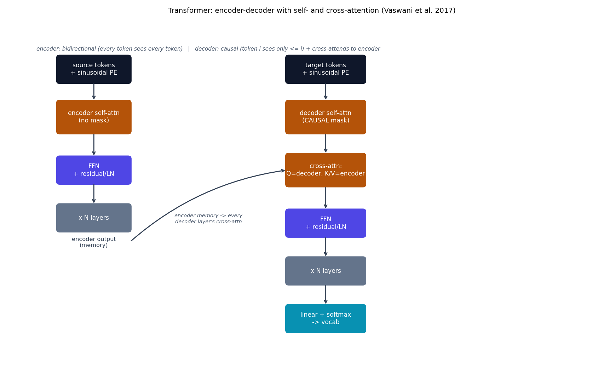

# Transformer -- encoder-decoder, self- and cross-attention

The Transformer {cite}`vaswani2017transformer` replaced sequential
(RNN) and local-window (CNN) sequence processing with a single idea:
every position attends directly to every other position in one matrix
multiply. This is the origin of the whole topic this repo covers --
{doc}`bert` and every later model here reuses or varies the same
mechanism.

## The equation

Scaled dot-product attention:

$$
\text{Attention}(Q,K,V) = \text{softmax}\!\left(\frac{QK^\top}{\sqrt{d_k}} + M\right)V
$$

$M$ is an additive mask: all zeros for encoder self-attention
(bidirectional -- every source token sees every other source token), and
$-\infty$ above the diagonal for decoder self-attention (causal -- token
$i$ only sees tokens $\le i$, since at generation time later tokens don't
exist yet). Multi-head attention runs this in parallel on $h$ learned
linear projections of $Q,K,V$:

$$
\text{MultiHead}(Q,K,V) = \text{Concat}(\text{head}_1,\dots,\text{head}_h)W^O, \qquad \text{head}_i = \text{Attention}(QW_i^Q, KW_i^K, VW_i^V)
$$

The decoder additionally uses **cross-attention**: $Q$ comes from the
decoder's own representation, but $K$ and $V$ come from the *encoder's*
output -- this is the only path by which information about the source
sentence reaches the translation being generated. Positional information
is a fixed, non-learned function of position (contrast {doc}`bert`'s
learned positional embeddings):

$$
PE_{(pos, 2i)} = \sin\!\left(\frac{pos}{10000^{2i/d_{\text{model}}}}\right), \qquad PE_{(pos, 2i+1)} = \cos\!\left(\frac{pos}{10000^{2i/d_{\text{model}}}}\right)
$$

## How it's built

`scaled_dot_product_attention` in
[`models/transformer/model.py`](https://github.com/agpoks/transformer-playground/blob/main/models/transformer/model.py)
is exactly the formula above:

```python
def scaled_dot_product_attention(q, k, v, mask=None):
    d_k = q.shape[-1]
    scores = q @ k.transpose(-2, -1) / math.sqrt(d_k)
    if mask is not None:
        scores = scores.masked_fill(mask, float("-inf"))
    weights = torch.softmax(scores, dim=-1)
    return weights @ v
```

`MultiHeadAttention` is three `nn.Linear` projections (`Q`, `K`, `V`), a
head-split/attention/head-merge, and an output projection -- no
`nn.MultiheadAttention` anywhere. `DecoderLayer.forward` shows all three
uses in one place:

```python
def forward(self, x, enc_out, tgt_mask, src_mask):
    x = self.norm1(x + self.drop(self.self_attn(x, x, x, tgt_mask)))       # causal self-attn
    x = self.norm2(x + self.drop(self.cross_attn(x, enc_out, enc_out, src_mask)))  # Q=decoder, K/V=encoder
    x = self.norm3(x + self.drop(self.ff(x)))
    return x
```

`TransformerModel` stacks `N` `EncoderLayer`s (bidirectional self-attn +
FFN) and `N` `DecoderLayer`s (causal self-attn + cross-attn + FFN), with
embeddings scaled by $\sqrt{d_{\text{model}}}$ plus the sinusoidal PE
added in before the first layer, and a final linear projection to the
target vocabulary.

**This repo uses post-norm** (residual add, then `LayerNorm`), matching
the original paper exactly -- most modern transformers (GPT-2 onward) use
pre-norm instead, because it trains more stably at large depth; post-norm
is kept here for historical fidelity, since this model is deliberately
small/shallow, where that stability difference doesn't show up much in
practice.



```{eval-rst}
.. plot::

    from transformer_playground.utils.diagrams import new_ax, box, arrow, INPUT, LINEAR, NONLIN, STATE, OTHER, ATTN

    fig, ax = new_ax(figsize=(13.0, 8.0), xlim=(0, 20), ylim=(0, 13))

    box(ax, 2.2, 11.0, 2.6, 1.0, "source tokens\n+ sinusoidal PE", INPUT)
    box(ax, 2.2, 9.2, 2.6, 1.2, "encoder self-attn\n(no mask)", ATTN)
    box(ax, 2.2, 7.2, 2.6, 1.0, "FFN\n+ residual/LN", NONLIN)
    box(ax, 2.2, 5.4, 2.6, 1.0, "x N layers", OTHER)
    arrow(ax, (2.2, 10.5), (2.2, 9.8))
    arrow(ax, (2.2, 8.6), (2.2, 7.7))
    arrow(ax, (2.2, 6.7), (2.2, 5.9))
    ax.text(2.2, 4.3, "encoder output\n(memory)", fontsize=9, ha="center", color="#334155")

    box(ax, 10.5, 11.0, 2.8, 1.0, "target tokens\n+ sinusoidal PE", INPUT)
    box(ax, 10.5, 9.2, 2.8, 1.2, "decoder self-attn\n(CAUSAL mask)", ATTN)
    box(ax, 10.5, 7.2, 2.8, 1.2, "cross-attn:\nQ=decoder, K/V=encoder", ATTN)
    box(ax, 10.5, 5.2, 2.8, 1.0, "FFN\n+ residual/LN", NONLIN)
    box(ax, 10.5, 3.4, 2.8, 1.0, "x N layers", OTHER)
    box(ax, 10.5, 1.6, 2.8, 1.0, "linear + softmax\n-> vocab", LINEAR)

    arrow(ax, (10.5, 10.5), (10.5, 9.8))
    arrow(ax, (10.5, 8.6), (10.5, 7.8))
    arrow(ax, (10.5, 6.6), (10.5, 5.7))
    arrow(ax, (10.5, 4.7), (10.5, 3.9))
    arrow(ax, (10.5, 2.9), (10.5, 2.1))

    arrow(ax, (3.5, 4.5), (9.1, 7.2), curve=-0.15)
    ax.text(6.3, 5.2, "encoder memory -> every\ndecoder layer's cross-attn", fontsize=8, ha="center", color="#475569", style="italic")

    ax.text(6.3, 11.7,
            "encoder: bidirectional (every token sees every token)   |   decoder: causal (token i sees only <= i) + cross-attends to encoder",
            fontsize=8.5, ha="center", color="#475569", style="italic")

    ax.set_title("Transformer: encoder-decoder with self- and cross-attention (Vaswani et al. 2017)", fontsize=11)
```

## Simplifications vs. the paper

- **Scale**: `d_model=128`, 4 heads, 2 layers, `d_ff=256` here, vs. the
  paper's base model (`d_model=512`, 8 heads, 6 layers) -- CPU-training-
  speed motivated, same as every other model in this repo.
- **No learning-rate warmup schedule** -- the paper's `Noam` schedule
  (linear warmup then inverse-sqrt decay) is replaced with a plain
  constant-LR Adam optimizer for simplicity.
- **Tokenizer**: a from-scratch word-level vocabulary, not the paper's
  byte-pair-encoding subword tokenizer -- simpler, but means out-of-
  vocabulary words become `<unk>` rather than being split into known
  subword pieces.
- **Dataset size**: a subset (a few thousand pairs) of the full real
  English-French corpus, and label smoothing is omitted.

## Try it

```bash
python models/transformer/example.py --device auto     # real English-French pairs
```

or open [`models/transformer/example.ipynb`](https://github.com/agpoks/transformer-playground/blob/main/models/transformer/example.ipynb).
Full runnable code: [`models/transformer/model.py`](https://github.com/agpoks/transformer-playground/blob/main/models/transformer/model.py) ·
[`models/transformer/README.md`](https://github.com/agpoks/transformer-playground/blob/main/models/transformer/README.md).

## References

```{eval-rst}
.. bibliography::
   :filter: docname in docnames
```
